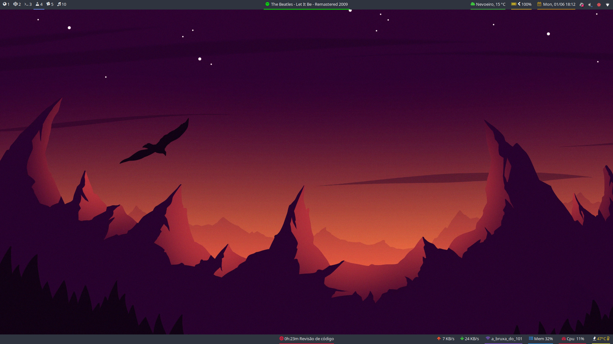
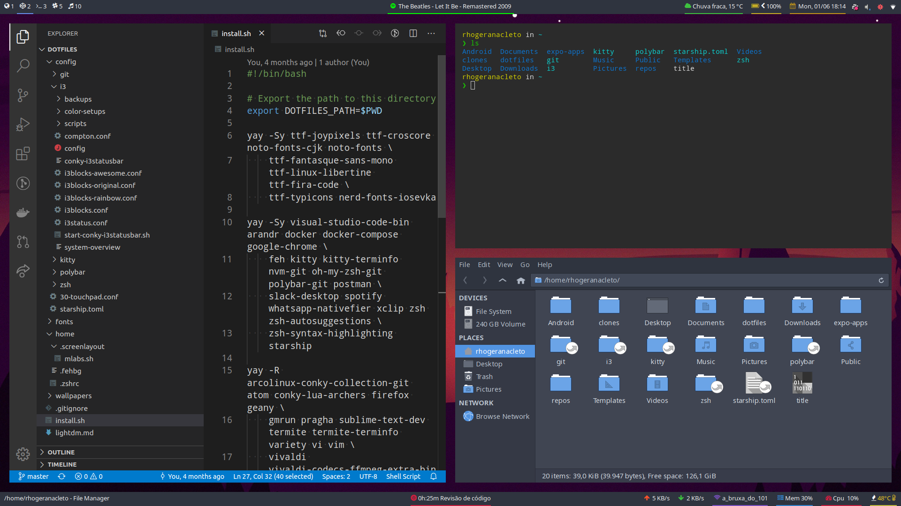

  <h1>
    🌈 rhogeranacleto's dotfiles 🌈
  </h1>

This is my dotfiles configuration.

This works very well at Arcolinux v19.x.x.

## Usage

Clone this repo and run `install.sh`! And that's it! :tada:

## Screenshots 🌃

_only background_

_with code, terminal and thunar_

## License

...

I'm just kidding, just use it!

---

## Llamas 🦙

Here some llama images that I like to make you happy 🥰

_llama with glasses drinking_

_llama arrogant but still cute_

_llama facing_

_another arrogant llama (yeah they are very arrogant_

